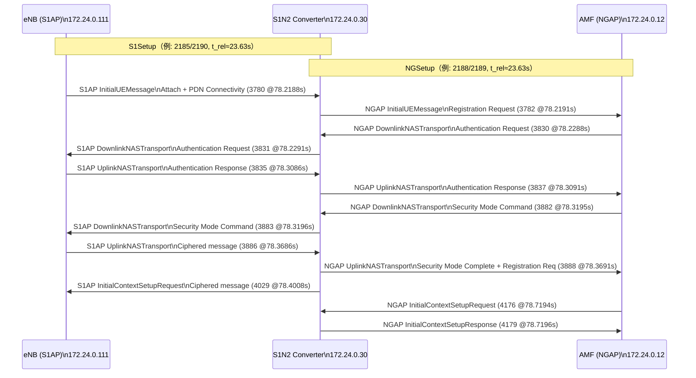
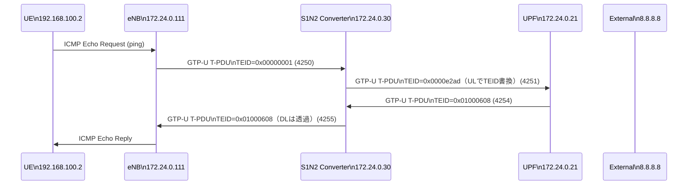

# ANALYSIS: 20251204_5.pcap（成功シーケンス抽出）

対象pcap: `/home/taihei/docker_open5gs_sXGP-5G/log/20251204_5.pcap`

このpcapには **失敗リトライ（Security mode reject 等）** も含まれます。ここでは、成功している区間（概ね `t_rel ≈ 78.219s` 以降）を中心に、S1N2 Converter（sXGP-5G）が観測した制御プレーン／ユーザプレーンの流れをドキュメント化します。

## 登場ノード（IP対応）

| 役割 | IP | 根拠（pcap上の観測） |
|---|---|---|
| eNB（S1AP側） | `172.24.0.111` | S1AP `S1SetupRequest` 送信元、S1AP `InitialUEMessage` 送信元 |
| S1N2 Converter（sXGP-5G） | `172.24.0.30` | S1AP/NGAP両方の終端（S1AP: `172.24.0.111` と、NGAP: `172.24.0.12` の間に位置） |
| AMF（N2側） | `172.24.0.12` | NGAP `NGSetupResponse` 送信元、NGAP `DownlinkNASTransport` 送信元 |
| UPF（N3側） | `172.24.0.21` | GTP-U Echo response/ユーザデータの送受信相手 |
| UE（内側IP） | `192.168.100.2` | GTP-U内側IPとして出現（ICMP pingの送信元/宛先側） |
| 外部疎通先 | `8.8.8.8` | GTP-U内側IPとして出現（ICMP ping宛先） |

注: SCTPのアドレスに `172.24.0.1` が混ざって見える箇所があります（SCTP multihoming表示等の影響）。本ドキュメントでは、実体の対向として `172.24.0.111`（eNB）と `172.24.0.30`（Converter）を主に扱います。

## 制御プレーン（S1AP + NGAP）: 成功区間の時系列

### 前提: セットアップ
- NGAP: `172.24.0.30 -> 172.24.0.12` で `NGSetupRequest/Response` が成立（例: frame 2188-2189, t_rel≈23.63s）
- S1AP: `172.24.0.111 -> 172.24.0.30` で `S1SetupRequest/Response` が成立（例: frame 2185-2190, t_rel≈23.63s）

### 成功区間（t_rel ≈ 78.219s〜）の抜粋

| frame | t_rel [s] | Proto | src -> dst | Info（WiresharkのInfo列） |
|---:|---:|---|---|---|
| 3780 | 78.218769 | S1AP | 172.24.0.111 -> 172.24.0.30 | InitialUEMessage, Attach request, PDN connectivity request |
| 3782 | 78.219059 | NGAP | 172.24.0.30 -> 172.24.0.12 | InitialUEMessage, Registration request |
| 3831 | 78.229082 | S1AP | 172.24.0.30 -> 172.24.0.111 | DownlinkNASTransport, Authentication request |
| 3830 | 78.228791 | NGAP | 172.24.0.12 -> 172.24.0.30 | DownlinkNASTransport, Authentication request |
| 3835 | 78.308551 | S1AP | 172.24.0.111 -> 172.24.0.30 | UplinkNASTransport, Authentication response |
| 3837 | 78.309136 | NGAP | 172.24.0.30 -> 172.24.0.12 | UplinkNASTransport, Authentication response |
| 3883 | 78.319647 | S1AP | 172.24.0.30 -> 172.24.0.111 | DownlinkNASTransport, Security mode command |
| 3882 | 78.319464 | NGAP | 172.24.0.12 -> 172.24.0.30 | DownlinkNASTransport, Security mode command |
| 3886 | 78.368619 | S1AP | 172.24.0.111 -> 172.24.0.30 | UplinkNASTransport, Ciphered message |
| 3888 | 78.369110 | NGAP | 172.24.0.30 -> 172.24.0.12 | UplinkNASTransport, Security mode complete, Registration request |
| 4029 | 78.400760 | S1AP | 172.24.0.30 -> 172.24.0.111 | InitialContextSetupRequest, Ciphered message |
| 4176 | 78.719413 | NGAP | 172.24.0.12 -> 172.24.0.30 | InitialContextSetupRequest |
| 4179 | 78.719630 | NGAP | 172.24.0.30 -> 172.24.0.12 | InitialContextSetupResponse |

（補足）NGAP側では `UEContextReleaseCommand`（frame 3889）が直後に見えます。pcap全体としては、前段で失敗/再試行が複数回発生しているため、コンテキスト整理の影響が混在している可能性があります。

### シーケンス図（統合ビュー）

## ユーザプレーン（GTP-U / UDP 2152）: TEID書換(UL)と透過(DL)の観測

成功後、GTP-U上で `192.168.100.2 -> 8.8.8.8` の ICMP ping が流れています。

### 抜粋（最初のping往復）

| frame | t_rel [s] | src -> dst | gtp.teid | 概要 |
|---:|---:|---|---:|---|
| 4250 | 81.769103 | 172.24.0.111 -> 172.24.0.30 | 0x00000001 | UL: ping request（内側: 192.168.100.2 -> 8.8.8.8） |
| 4251 | 81.769146 | 172.24.0.30 -> 172.24.0.21 | 0x0000e2ad | UL: ConverterがTEIDを変えて転送（N3側） |
| 4254 | 81.773189 | 172.24.0.21 -> 172.24.0.30 | 0x01000608 | DL: ping reply（N3側から到着） |
| 4255 | 81.773225 | 172.24.0.30 -> 172.24.0.111 | 0x01000608 | DL: ConverterはTEIDを書換せず、そのままeNB側へ送出 |

### シーケンス図（GTP-U）

## まとめ（このpcapが示している事実）

- S1N2 Converterは、S1AP側（eNB `172.24.0.111`）とNGAP側（AMF `172.24.0.12`）の間で、NASを含む手続きを中継している（Registration/Authentication/Security mode/Initial Context Setup 等）。
- ユーザプレーンはGTP-Uで疎通しており、UL方向でTEIDが書き換わっている一方、DL方向ではTEIDがそのまま転送されている（Hybrid Proxy動作の観測）。
